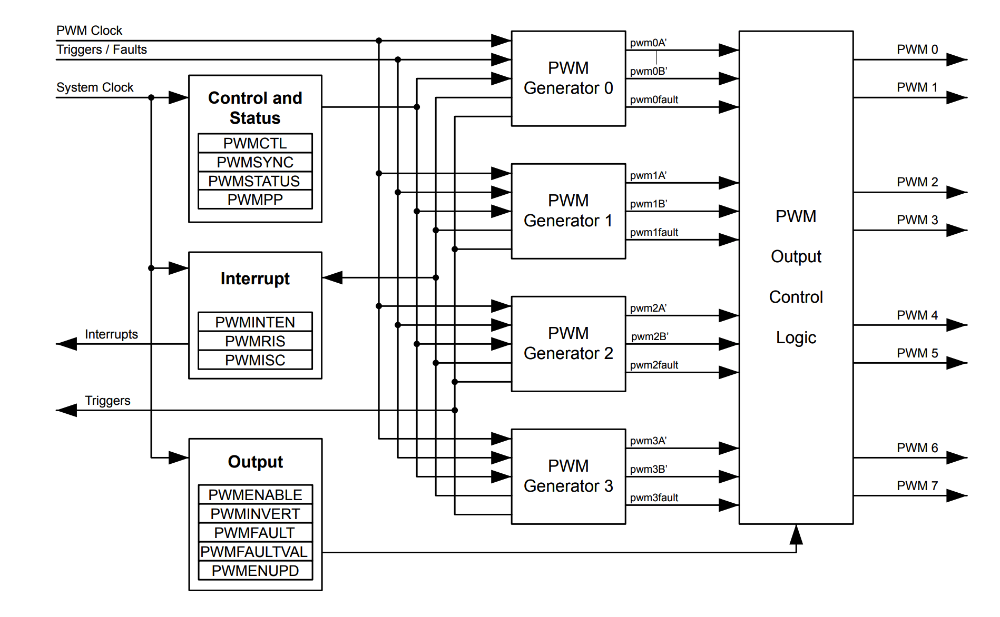

# Pulse Width Modulation

** NOTE **: this document contains direct text from [Tiva™ C Series TM4C123GH6PM Microcontroller Data Sheet](http://www.ti.com/lit/ds/symlink/tm4c123gh6pm.pdf), I include the source of text for each section, if you want to learn more of the original text from Texas Instruments, please visit the data sheet, Tiva™ C Series TM4C123GH6PM Microcontroller Data Sheet would be called as TM4C123GH6PM Data Sheet below.

## Introduction([TM4C123GH6PM Data Sheet](http://www.ti.com/lit/ds/symlink/tm4c123gh6pm.pdf), page 1230):
Pulse width modulation (PWM) is a powerful technique for digitally encoding analog signal levels. High-resolution counters are used to generate a square wave, and the duty cycle of the square wave is modulated to encode an analog signal. Typical applications include switching power supplies and motor control.
The TM4C123GH6PM microcontroller contains **two PWM modules**, each with **four PWM generator blocks** and a control block, for a total of **16 PWM outputs**. The control block determines the polarity of the PWM signals, and which signals are passed through to the pins.
Each PWM generator block produces two PWM signals that share the same timer and frequency and can either be programmed with independent actions or as a single pair of complementary signals with dead-band delays inserted. The output signals, pwmA' and pwmB', of the PWM generation blocks are managed by the output control block before being passed to the device pins as **MnPWM0** and **MnPWM1** or **MnPWM2** and **MnPWM3**, and so on.

## PWM Generator Block Features([TM4C123GH6PM Data Sheet](http://www.ti.com/lit/ds/symlink/tm4c123gh6pm.pdf), page 1230):
- One fault-condition handling inputs to quickly provide low-latency shutdown and prevent damage
to the motor being controlled, for a total of two inputs.
- One 16-bit counter
    - Runs in **Down or Up/Down mode**
    - Output frequency controlled by a **16-bit load value**
    - Load value updates can be synchronized
    - Produces output signals at **zero** and **load** value
- Two PWM comparators
    - Comparator value updates can be synchronized
    - Produces output signals on match
- PWM signal generator
    - Output PWM signal is constructed based on actions taken as a result of the counter and PWM comparator output signals
    - Produces two independent PWM signals

## Block Diagram([TM4C123GH6PM Data Sheet](http://www.ti.com/lit/ds/symlink/tm4c123gh6pm.pdf), page 1232):

## PWM Signal Pin Assignment([TM4C123GH6PM Data Sheet](http://www.ti.com/lit/ds/symlink/tm4c123gh6pm.pdf), page 1233):
| Name | Pin Assignment |
| :---: | :---: |
| M0PWM0 | PB6 |
| M0PWM1 | PB7 |
| M0PWM2 | PB4 |
| M0PWM3 | PB5 |
| M0PWM4 | PE4 |
| M0PWM5 | PE5 |
| M0PWM6 | PC4, PD0 |
| M0PWM7 | PC5, PD1 |
| M1PWM0 | PD0 |
| M1PWM1 | PD1 |
| M1PWM2 | PA6, PE4 |
| M1PWM3 | PA7, PE5 |
| M1PWM4 | PF0 |
| M1PWM5 | PF1 |
| M1PWM6 | PF2 |
| M1PWM7 | PF3 |

Some key set up for PWM as below:

PWM0_0_CTL_R &= ~PWM_0_CTL_MODE;          // re-loading down-counting mode

`PWM0_0_CTL_R` is M0PWM0 Conttrol Register, here we set the `MODE` bit to 0 to enable Count-Down mode.
`PWM0_0_CTL_R` is declared in [tm4c123gh6pm.h](../../tm4c123gh6pm.h) line 742:

#define PWM0_0_CTL_R            (*((volatile uint32_t *)0x40028040))

Here we use `PWM_0_CTL_MODE` , it is defined in line 3457 in [tm4c123gh6pm.h](../../tm4c123gh6pm.h).

#define PWM_0_CTL_MODE          0x00000002  // Counter Mode

The complete bit field definitions for PWM0_0_CTL_R are between line 3430 to line 3458 in [tm4c123gh6pm.h](../../tm4c123gh6pm.h).
To learn more about PWM0_0_CTL_R, please refer to [TM4C123GH6PM Data Sheet](http://www.ti.com/lit/ds/symlink/tm4c123gh6pm.pdf) page 1266.

PWM0_0_GENA_R |= PWM_0_GENA_ACTLOAD_ZERO; // PB6 goes low on LOAD
PWM0_0_GENA_R |= PWM_0_GENA_ACTCMPAD_ONE; // PB6 goes high on CMPA down

PWM0_0_LOAD_R = period - 1;               // cycles needed to count down to 0

PWM0_0_CMPA_R = duty - 1;                 // count value when output rises

PWM0_0_CTL_R |= PWM_0_CTL_ENABLE;         // start PWM0

PWM0_ENABLE_R |= PWM_ENABLE_PWM0EN;       // enable M0PWM0/PB6
